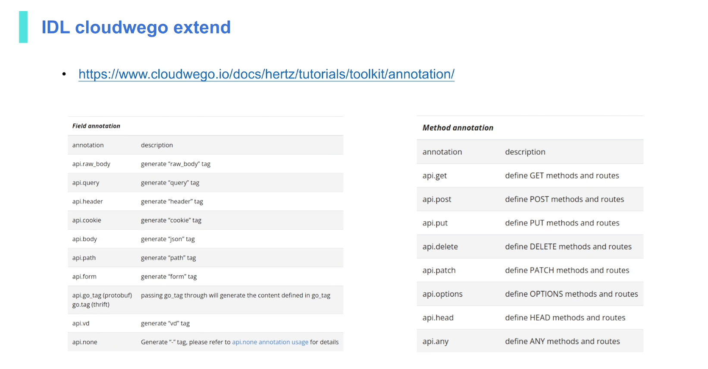

## 开发环境

### `go mod init github.com/sza0415/GomailDemo/hello_world`

```shell
➜  hello_world git:(main) go mod init github.com/sza0415/GomailDemo/hello_world
go: creating new go.mod: module github.com/sza0415/GomailDemo/hello_world
```

- **含义**：`go mod` 是 Go 语言中用于模块（module）管理的工具。`init` 子命令用于初始化一个新的模块。后面跟着的 `github.com/sza0415/GomailDemo/hello_world` 是模块的名称，通常遵循 Go 模块的命名规范，一般使用项目的远程仓库路径（这里只是示例路径）。执行该命令后，会在当前目录下生成一个 `go.mod` 文件，用于记录项目的模块信息、依赖关系等。


### `go get -u github.com/cloudwego/hertz`

```
➜  hello_world git:(main) ✗ go get -u github.com/cloudwego/hertz
go: downloading github.com/cloudwego/hertz v0.9.5
go: added github.com/cloudwego/hertz v0.9.5
```

- **含义**：`go get` 命令用于下载并安装指定的 Go 包。`-u` 选项表示更新已经安装的包到最新版本。这里 `github.com/cloudwego/hertz` 是要下载的包的路径，`hertz` 是一个 Go 语言的高性能 HTTP 框架。此命令会下载 `hertz` 框架及其相关依赖，并将其添加到项目的 `go.mod` 和 `go.sum` 文件中进行管理。


`go mod tidy` 是 Go 语言模块（module）管理中的一个重要命令，主要作用是整理和维护项目的模块依赖，具体如下：

### 依赖更新与清理

- **移除未使用的依赖**：在项目开发过程中，可能会使用 `go get` 命令引入一些包，但后续代码调整后，部分包实际上不再被项目使用。`go mod tidy` 会自动检查项目代码，将这些不再使用的包从 `go.mod` 和 `go.sum` 文件中移除。例如，一开始项目引入了某个用于数据加密的包，但后来加密逻辑被替换，这个包就不再被使用，执行 `go mod tidy` 后，它会从依赖记录中删除。
- **更新依赖到合适版本**：它会根据 `go.mod` 文件中声明的依赖要求，检查本地 `go.sum` 文件中记录的依赖版本，并将其更新到符合语义导入版本规则的最新版本。比如，项目依赖的某个包发布了新的小版本更新（修复了一些小问题或增加了少量功能），`go mod tidy` 会在不破坏项目兼容性的前提下，将该包更新到最新的小版本。

## echo.thrift

```thrift
namespace go api
struct Request{
    1: string message
}

struct Response{
    1: string message
}

service Echo{
    Response echo(1:Request req)
}
```

依赖于cwgo和thriftgo

```
go install github.com/cloudwego/thriftgo@latest
```

```
 mkdir -p demo/demo_thrift
```

```
 cd demo/demo_thrift 
 cwgo server --type RPC --module github.com/sza0415/GomailDemo/demo/demo_thirft --service demo_thrift --idl ../../idl/echo.thrift 
go: creating new go.mod: module github.com/sza0415/GomailDemo/demo/demo_thirft

```


## 脚手架 Protocol Buffers

> 你可能不知道ProtoBuf，但一定知道json或者xml，从一定意义上来说他们的作用是一样的。
>
> ProtoBuf全称：protocol buffers，直译过来是：“协议缓冲区”，是一种与语言无关、与平台无关的可扩展机制，用于序列化结构化数据。
>
> **和json\xml最大的区别是：json\xml都是基于文本格式，ProtoBuf是二进制格式。**
>
> *ProtoBuf相比于json\XML，更小（3 ~ 10倍）、更快（20 ~ 100倍）、更为简单。*
>
> 我们只需要定义一次数据结构，就可以使用ProtoBuf生成源代码，轻松搞定在各种数据流和各种语言中写入、读取结构化数据。

### 安装

这是官网下载地址：https://github.com/protocolbuffers/protobuf/releases

**注意：我们需要将下载得到的可执行文件`protoc`所在的 bin 目录加到我们电脑的环境变量中。**

```shell
sudo cp protoc /usr/local/bin # 把可执行文件放入bin
sudo cp -a google /usr/local/include # protobuf需要的扩展文件也拷贝到include
```

```shell
mkdir -p demo/demo_proto # 当使用 -p 选项时，mkdir 命令会创建所有必要的父目录，以确保目标目录路径能够完整创建。这意味着，如果在创建目标目录的过程中，发现其父目录不存在，mkdir -p 会自动创建这些缺失的父目录。
```

> cwgo 是 CloudWeGo All in one 代码生成工具，整合了各个组件的优势
>
> cwgo 工具支持通过 IDL(thrift/protobuf) 生成 HTTP Server 或 RPC Server 的代码，方便用户开发。
>
> CWGO 是一个用于提升代码开发效率的工具。它基于 **Kitex** 和 **Hertz** 等 CloudWeGo 生态的核心组件，可以帮助开发者生成：
>
> 1. 工程化的 MVC 模板；
> 2. Kitex 和 Hertz 的服务器端代码；
> 3. 客户端调用代码；
> 4. 数据库的 CRUD 操作。

```bash
cd demo/demo_proto
cwgo server -I ../../idl --type RPC --module github.com/sza0415/GomailDemo/demo/demo_proto --service demo_proto --idl ../../idl/echo.proto
```

```
  cwgo server -I ../../idl --type RPC --module github.com/sza0415/GomailDemo/demo/demo_proto --service demo_proto --idl ../../idl/echo.proto
```
  cwgo工具生成代码。具体参数含义如下：

  - `-I ../../idl`：指定导入路径，让 `cwgo` 工具在 `../../idl` 目录下查找相关文件。
  - `--type RPC`：指定生成代码的类型为远程过程调用（RPC）。
  - `--module github.com/sza0415/GomailDemo/demo/demo_proto`：指定生成代码所属的 Go 模块名称。
  - `--service demo_proto`：指定服务的名称。
  - `--idl ../../idl/echo.proto`：指定用于生成代码的 IDL（接口定义语言）文件为 `../../idl/echo.proto`。


### go work

> 使用 `go work` 管理多模块
>
> 如果这两个模块在一个项目中存在关联，你可以使用 Go 1.18 及以上版本引入的 `go work` 功能来统一管理它们。以下是具体步骤：

#### 1.**初始化工作区**：

首先要确保存在一个 `go.work` 文件来定义工作区。如果没有，可以在项目根目录下使用 `go work init` 命令来创建，例如

- ```
  .
  ├── demo
  │   └── demo_proto
  │       ├── go.mod
  │       ├── go.sum
  │ 			.....
  │       ├── main.go
  │       ├── readme.md
  │       └── script
  │           └── bootstrap.sh
  ├── gomailLearningNote.md
  ├── hello_world
  │   ├── go.mod
  │   ├── go.sum
  │   └── main.go
  └── idl
      └── echo.proto
  ```

  我的 demo/demo_proto和hello_world分别为两个module的目录

  ```bash
  go work init ./demo/demo_proto ./hello_world
  ```

  该命令会创建一个go.work的文件，内容如下：

  ```
  go 1.23.4
  
  use (
  	./demo/demo_proto
  	./hello_world
  )
  ```


#### 验证工作区

初始化完成后，你可以在父目录下执行一些 Go 命令，如 `go build`、`go test` 等，这些命令会同时作用于工作区内的所有模块，方便你进行统一的构建和测试。

模块间的依赖：

 如果 `hello_world` 模块需要使用 `demo/demo_proto` 模块中的代码，你可以在 `hello_world` 模块的 `go.mod` 文件中添加相应的依赖。例如：

  ```bash
  cd hello_world
  go get github.com/sza0415/GomailDemo/demo/demo_proto
  ```

  这样，`hello_world` 模块就可以导入并使用 `demo/demo_proto` 模块中的包了。

#### go work use .

##### 命令含义

`go work use` 用于将指定路径的 Go 模块添加到当前的工作区（由 `go.work` 文件定义）中。其中 `.` 代表当前目录，所以 `go work use .` 就是把当前所在目录下的 Go 模块添加到工作区里。

##### 使用场景

在大型项目或者多模块项目开发中，不同的模块可能会有相互依赖关系。使用 `go work` 可以将这些模块组织到一个工作区中，方便统一管理和开发。当你在某个模块目录下，想要把该模块纳入到已有的工作区时，就可以使用 `go work use .` 命令。

### go run .

`go run .` 是 Go 语言开发中一个常用的命令，下面从命令功能、使用场景、注意事项几个方面详细介绍：

### 命令功能

`go run` 是 Go 语言自带的一个命令，用于编译并运行 Go 程序。其中，`.` 代表当前目录。所以 `go run .` 命令的作用是在当前目录下查找并编译所有 `.go` 文件，然后运行其中包含 `main` 函数的 `main` 包程序。

### 生成makefile文件  保存命令

```makefile
.PHONY: gen-demo-proto

gen-demo-proto:
	@cd demo/demo_proto && cwgo server -I ../../idl --type RPC --module github.com/sza0415/GomailDemo/demo/demo_proto --service demo_proto --idl ../../idl/echo.proto

.PHONY: gen-demo-thrift
gen-demo-thrift:
	@cd demo/demo_thrift && cwgo server --type RPC --module github.com/sza0415/GomailDemo/demo/demo_thirft --service demo_thrift --idl ../../idl/echo.thrift 
                            
```

在包含该 Makefile 的目录下，打开终端并运行以下命令：

```bash
make gen-demo-proto
```

Makefile 会执行上述定义的操作，进入 `demo/demo_proto` 目录并调用 `cwgo` 工具根据 `echo.proto` 文件生成 RPC 相关的代码。




## kitex

### Kitex 开发前置知识

#### RPC

**RPC** (Remote Procedure Call) ，即远程过程调用。通俗来讲，就是调用远端服务的某个方法，并获取到对应的响应。RPC 本质上定义了一种通信的流程，而具体的实现技术没有约束，核心需要解决的问题为**序列化**与**网络通信**。如可以通过 `gob/json/pb/thrift` 来序列化和反序列化消息内容，通过 `socket/http` 来进行网络通信。只要客户端与服务端在这两方面达成共识，能够做到消息正确的解析接口即可。

一般来说，RPC 框架包括了代码生成、序列化、网络通讯等，主流的微服务框架也会提供服务治理相关的能力，比如服务发现、负载均衡、熔断等等。

### RPC 调用的流程

一次 rpc 调用包括以下基本流程，分为客户端和服务端两个部分：

1.（客户端）构造请求参数，发起调用

2.（客户端）通过服务发现、负载均衡等得到服务端实例地址，并建立连接

3.（客户端）请求参数序列化成二进制数据

4.（客户端）通过网络将数据发送给服务端

------

5.（服务端）服务端接收数据

6.（服务端）反序列化出请求参数

7.（服务端）handler 处理请求并返回响应结果

8.（服务端）将响应结果序列化成二进制数据

9.（服务端）通过网络将数据返回给客户端

------

10.（客户端）接收数据

11.（客户端）反序列化出结果

12.（客户端）得到调用的结果

其中步骤 2 中包含的流程称为「**服务治理**」，通常包括并不限于服务发现、负载均衡、ACL、熔断、限流等等功能。这些功能是由其他组件提供的，并不是 Thrift 框架所具有的功能。

### RPC 服务开发流程

例如基于 Thrift 的 RPC 服务开发，通常包括如下过程：

1. 编写 IDL，定义服务 (Service) 接口。
2. 使用 thrift（或者等价的生成代码工具，如 kitex 等）生成客户端、服务端的支持代码。
3. 服务端开发者编写 handler ，即请求的处理逻辑。
4. 服务端开发者运行服务监听端口，处理请求。
5. 客户端开发者编写客户端程序，经过服务发现连接上服务端程序，发起请求并接收响应。

## IDL

**IDL** 全称是 Interface Definition Language，接口定义语言。

如果我们要使用 RPC 进行调用，就需要知道对方的接口是什么，需要传什么参数，同时也需要知道返回值是什么样的，就好比两个人之间交流，需要保证在说的是同一个语言、同一件事。IDL 就是为了解决这样的问题，通过 IDL 来约定双方的协议，就像在写代码的时候需要调用某个函数，我们需要知道 `签名`一样。

对于 RPC 框架，IDL 不仅作为接口描述语言，还会根据 IDL 文件生成指定语言的接口定义模块，这样极大简化了开发工作。服务提供方（服务端）需要做的变为 编写 IDL -> 使用代码生成工具生成代码 -> 实现接口；服务调用方（客户端）只需根据服务提供方（服务端）提供的 IDL 生成代码后进行调用。这当中还有服务发现、负载均衡等问题，但不属于 IDL 范畴，故不展开介绍。

Kitex 默认支持 `thrift` 和 `proto3` 两种 IDL。本文简单介绍 Thrift IDL 语法，proto3 语法可参考：[Language Guide(proto3)](https://developers.google.com/protocol-buffers/docs/proto3)

> 注意：Thrift 是一款 RPC 框架，其使用的 IDL 以 .thrift 为后缀，故常常也使用 thrift 来表示 IDL，请根据上下文判断语意。
